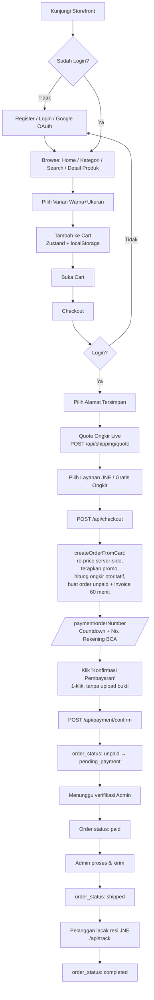
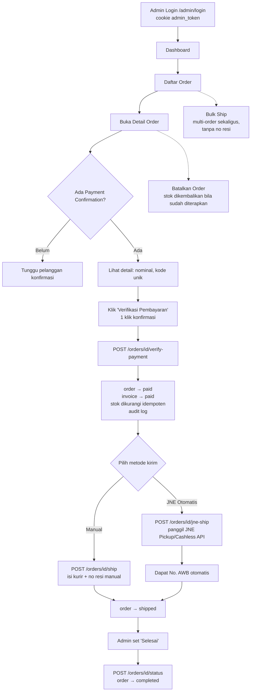
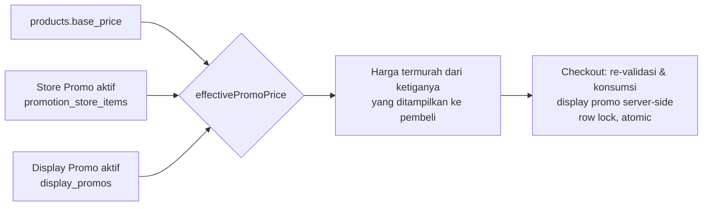
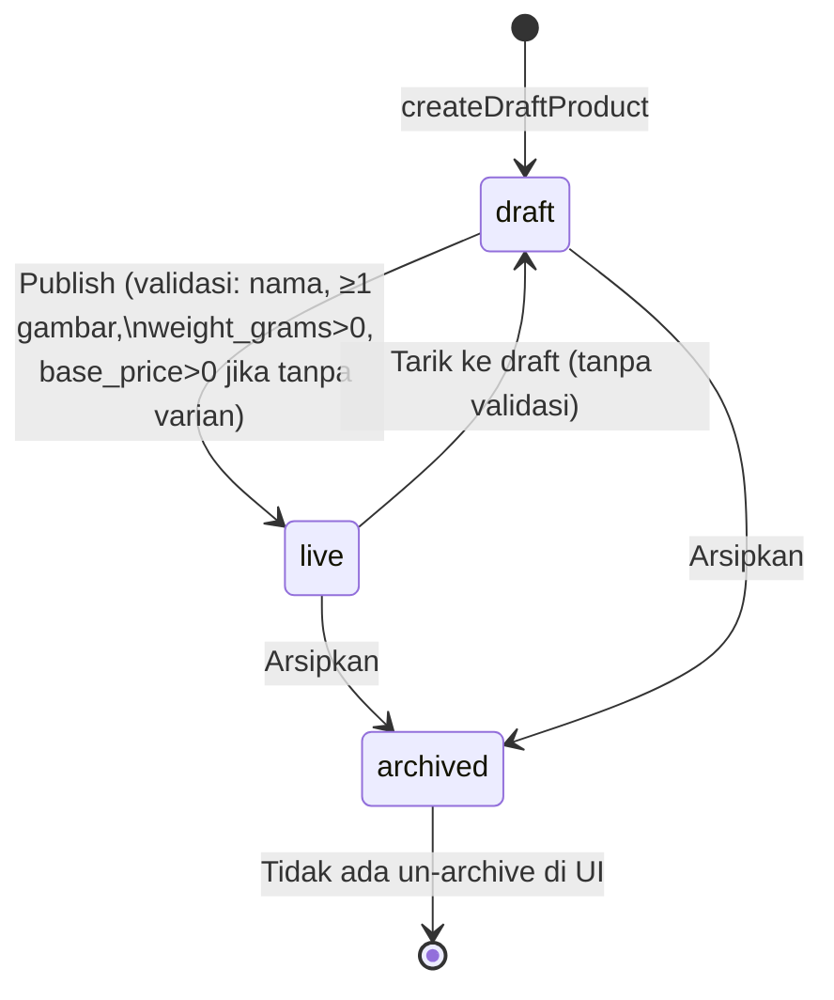

# AYRES Shop — Dokumentasi Teknis & Flow Aplikasi

E-commerce sportswear berbasis **Next.js 16 (App Router)** + **MySQL/MariaDB**, dengan storefront pelanggan, panel admin, sistem pembayaran manual transfer bank (konfirmasi 1‑klik), dan integrasi ongkir/resi **JNE**.

> Dokumen ini adalah hasil audit menyeluruh terhadap kode yang berjalan saat ini (bukan spekulasi desain). Bagian **"Catatan & Known Issues"** di tiap bab mencantumkan bug, inkonsistensi, dan fitur yang belum tersambung ke UI — penting dibaca sebelum menganggap sesuatu "sudah jadi".

## Daftar Isi

1. [Tech Stack](#tech-stack)
2. [Menjalankan Proyek](#menjalankan-proyek)
3. [Arsitektur & Struktur Folder](#arsitektur--struktur-folder)
4. [Autentikasi & Akun](#1-autentikasi--akun)
5. [Katalog Produk, Storefront & Cart](#2-katalog-produk-storefront--cart)
6. [Checkout, Pembayaran & Ongkir](#3-checkout-pembayaran--ongkir)
7. [Admin — Produk & Promosi](#4-admin--produk--promosi)
8. [Admin — Order, JNE & Master Data](#5-admin--order-jne--master-data)
9. [Skema Database](#6-skema-database)
10. [Diagram Flow Lengkap](#7-diagram-flow-lengkap)
11. [Known Issues Rangkuman](#8-known-issues-rangkuman-lintas-modul)
12. [Environment Variables](#9-environment-variables)

---

## Tech Stack

| Layer | Teknologi |
|---|---|
| Framework | Next.js 16 (App Router, Server Components + Route Handlers), React 19 |
| Bahasa | TypeScript |
| Database | MySQL/MariaDB via `mysql2/promise` (connection pool, raw SQL — tanpa ORM) |
| Auth | JWT (`jsonwebtoken`) di cookie httpOnly + `bcryptjs` untuk password |
| State client | Zustand (cart, bahasa, product-view — persisted ke `localStorage`) |
| Styling | Tailwind CSS 4 |
| Upload file | Custom (`lib/upload.ts`), disimpan lokal (opsional di luar folder deploy via `UPLOAD_DIR`) |
| Shipping | JNE API (tarif, tracking, AWB pickup/cashless) — sandbox by default |
| i18n | Custom ringan (`lib/i18n.ts`), ID/EN, **hanya sebagian UI** yang diterjemahkan |

Next.js image optimizer **dimatikan** (`next.config.ts` → `unoptimized: true`) karena sharp/cache sering gagal di shared hosting (Hostinger).

---

## Menjalankan Proyek

```bash
npm install
cp .env.example .env      # isi DB_* minimal; sisanya opsional
npm run dev                # http://localhost:3000
```

- Skema database: import `database/onlineshop.sql` (lokal/XAMPP) atau `database/onlineshop_hostinger.sql` (identik, tanpa `CREATE DATABASE`/`USE`, untuk phpMyAdmin Hostinger).
- **Auto-migration**: setiap request pertama server memanggil `ensureMigrated()` (`app/layout.tsx` → `lib/migrate.ts`), menjalankan migrasi DDL idempoten yang tercatat di tabel `schema_migrations`. Migrasi ini **lebih maju** dari `onlineshop.sql` — lihat [Skema Database](#6-skema-database).
- Login admin default (seed): `admin@ayres.com` / `admin123`.
- Testing lokal dengan `next start` (mode production) akan otomatis load `.env.production` (kredensial Hostinger). Untuk paksa ke DB lokal:
  ```bash
  DB_HOST=localhost DB_USER=root DB_PASSWORD= DB_NAME=onlineshop npx next start
  ```
  atau cukup pakai `npm run dev`.

---

## Arsitektur & Struktur Folder

```
app/
  (auth)/            → /login, /register (layout terpisah, tanpa header/footer shop)
  (shop)/             → semua halaman storefront (home, produk, cart, checkout, account, ...)
  admin/
    login/            → /admin/login (tanpa proteksi)
    (protected)/       → semua halaman admin, digerbangi oleh requireAdmin() di layout.tsx
  api/                → Route Handlers (REST-ish), dikelompokkan mirror dengan folder page
  uploads/[...path]/  → file-serving route untuk UPLOAD_DIR di luar public/
lib/
  auth.ts, user-auth.ts, admin-auth.ts   → JWT & session helper
  db.ts               → koneksi pool MySQL (timezone dipin ke WIB +07:00)
  migrate.ts          → auto-migration runtime
  jne.ts              → klien API JNE (tarif, tracking, AWB pickup/cashless)
  queries/            → semua akses DB (raw SQL), dipisah per domain & admin/*
  store/              → Zustand stores (cart, language, product-view)
components/
  shop/               → komponen storefront
  admin/               → komponen admin
  ui/                  → komponen dasar (button, input, toast, dll)
database/
  onlineshop.sql, onlineshop_hostinger.sql, migrations/001_display_promos.sql
```

**Tidak ada `middleware.ts`** di proyek ini. Semua proteksi rute dilakukan **per-layout/per-page/per-route-handler**:
- Storefront: `app/(shop)/account/layout.tsx` memanggil `getCurrentUser()` dan `redirect()` bila belum login. Beberapa halaman lain (mis. `/wishlist`) melakukan redirect sendiri.
- Admin: `app/admin/(protected)/layout.tsx` memanggil `requireAdmin()` (`lib/admin-auth.ts`) yang me-redirect ke `/admin/login` bila tidak ada sesi admin valid — ini adalah **satu-satunya gerbang** untuk seluruh `/admin/(protected)/*`.
- Setiap API route men-duplikasi pemanggilan `getCurrentUser()`/`getCurrentAdmin()` sendiri-sendiri (tidak ada wrapper/middleware bersama).

---

## 1. Autentikasi & Akun

### 1.1 Auth Pelanggan (cookie `token`)

`lib/auth.ts`: `signToken({userId, email, role})` — JWT HS256, secret `process.env.JWT_SECRET || "fallback-secret"`, **expiry 7 hari**. Password di-hash dengan `bcryptjs` (10 rounds).

| Endpoint | Fungsi |
|---|---|
| `POST /api/auth/register` | Validasi email/telp(regex ID)/password≥6 → cek duplikat → insert `users` (`email_verified_at=NOW()` langsung, **fitur OTP sudah dihapus**) → set cookie `token` → auto-login instan |
| `POST /api/auth/login` | Cek `users` by email → bcrypt compare → update `last_login_at` → set cookie `token` |
| `POST /api/auth/logout` | Hapus cookie `token` (maxAge 0) |
| `GET /api/auth/me` | Decode cookie → re-query `users` (termasuk cek `is_active`) |

Pola proteksi: server component memanggil `getCurrentUser()` (`lib/user-auth.ts`) — cookie → `verifyToken` → `SELECT` ulang ke `users` (tidak ada cache, query per request). Halaman yang butuh login redirect ke `/login?next=<path>`.

### 1.2 Login via Google (OAuth)

`GET /api/auth/google` → jika `GOOGLE_CLIENT_ID` tidak diset, redirect balik ke `/login?error=...` (graceful, tidak crash). Jika ada, generate `state` random (cookie `oauth_state`, 600s) → redirect ke consent screen Google.

`GET /api/auth/google/callback` → validasi `state` (CSRF) → tukar `code` dengan access token → ambil profil → cari/insert `users` (akun baru dari Google mendapat **password placeholder acak** yang tidak pernah diketahui user) → set cookie `token` → redirect `/`.

Tombol "Lanjutkan dengan Google" (`components/shop/google-button.tsx`) selalu tampil terlepas dari konfigurasi env — jika belum diisi, klik akan gagal dengan pesan error, bukan tombol yang disembunyikan.

### 1.3 Auth Admin (cookie `admin_token`, terpisah total dari auth pelanggan)

| Endpoint | Fungsi |
|---|---|
| `POST /api/auth/admin/login` | Cek `admins` JOIN `admin_roles` → bcrypt compare → cek `is_active` → cookie `admin_token` |
| `POST /api/auth/admin/logout` | Hapus cookie `admin_token` |
| `GET /api/auth/admin/me` | Decode → cek `payload.role === "admin"` eksplisit → `is_active` |

`requireAdmin()` hanya memverifikasi *"admin aktif yang login"*, **tidak melakukan RBAC per-permission** — role (`admin_roles.name`, mis. `super_admin`) hanya disimpan sebagai label, tidak dipakai untuk membatasi akses ke fitur tertentu di level rute manapun yang teraudit.

### 1.4 Akun Pelanggan (`/account/*`)

- **Profile** — ubah nama/telp (`PATCH /api/account/profile`), hapus akun = **soft delete** (`is_active=0`, tidak reset email/telp — akun terhapus **tidak bisa daftar ulang** dengan email sama selamanya).
- **Password** — `POST /api/account/password`, verifikasi password lama, min 8 karakter.
- **Addresses** — CRUD `user_addresses`, satu `is_default` per user, alamat pertama otomatis default, default dipindah otomatis saat alamat default dihapus.
- **Orders (pending/history)** — read-only, `lib/queries/user-orders.ts`, join `orders`+`order_items`+`shipments`+`couriers`.
- **Wishlist** — toggle via `POST/DELETE /api/wishlist`, tabel `wishlists` (unique `user_id`+`product_id`).

### Catatan & Known Issues — Auth

- **Fallback JWT secret** (`"fallback-secret"`) — jika `JWT_SECRET` tidak diset di env manapun, token bisa dipalsukan (berlaku untuk role admin *dan* customer karena berbagi fungsi sign yang sama).
- **Tidak ada rate limiting** di `/api/auth/login`, `/api/auth/admin/login`, `/api/auth/register` — rawan brute force.
- **Tidak ada CSRF token** untuk POST/PATCH/DELETE (hanya mengandalkan `sameSite=lax`).
- Response body `login`/`admin/login` mengembalikan JWT mentah selain cookie httpOnly — eksposur berlebih ke JS sisi klien.
- `email_verified_at` selalu `NOW()` saat register — sisa dari fitur OTP yang sudah dihapus, badge "terverifikasi" di profil sekarang tidak bermakna.
- Role admin di JWT **tidak divalidasi ulang** terhadap `admin_roles` saat request — bila role admin dihapus setelah token terbit, admin tetap punya akses hingga token kedaluwarsa (7 hari), karena hanya `is_active` yang dicek ulang.

---

## 2. Katalog Produk, Storefront & Cart

### 2.1 Home Page (`app/(shop)/page.tsx`)

Urutan render: **Hero banner** (carousel gambar statis) → **Kategori** (leaf-only, ikon dari `public/kategori/*.png` atau `image_url` admin atau foto produk terlaris) → **Best Sellers** (`total_sold DESC`, badge muncul jika `total_sold > 200`) → **Display Promo banner** (hanya jika ada promo aktif) → **New Arrivals** (`published_at DESC`) → **Features bar** (statis, trust badge).

`HeroTypewriter`/`TextType` (efek gsap) — **dead code**, tidak dipakai di manapun.

### 2.2 Collections, Product Detail, Search

- `/collections` — semua produk live.
- `/collections/[slug]` — resolusi bertingkat: slug khusus (`new-arrivals`/`best-sellers`/`sale`) → kategori nyata → fallback fuzzy keyword search.
- `/products/[slug]` — detail produk + varian (warna/ukuran) + galeri gambar yang otomatis ganti sesuai warna dipilih (via store Zustand `product-view`).
- `/search?q=` — semua keyword harus match (AND), `LIKE` pada nama/deskripsi, tanpa full-text index/ranking.

### 2.3 Resolusi Harga (paling penting untuk dipahami)

Tiga sumber harga: `products.base_price`, **store promo** (`promotion_store_items`), **display promo** (`display_promos`).

`effectivePromoPrice(base, storePrice, display)` (`lib/queries/display-promo.ts`) → **harga termurah dari ketiganya yang menang**, dipakai di home/collections(slug)/search/related products.

⚠️ **Inkonsistensi**: halaman `/collections` (root, tanpa slug) **tidak** menyertakan store promo (hanya display promo) — produk yang sama bisa tampil beda harga di "Semua Koleksi" vs halaman lain saat store promo aktif. Sort `price_asc`/`price_desc` juga memakai `base_price` mentah, bukan harga efektif setelah diskon.

Halaman detail produk **tidak** memakai `effectivePromoPrice`, melainkan re-implementasi logika serupa secara terpisah, dan **secara sengaja menyembunyikan badge diskon untuk produk dengan varian** (`hasPromo = ... && !product.has_variant`).

### 2.4 Cart

**100% client-side** — Zustand + `localStorage` (key `ayres-cart`), **tidak ada tabel DB** yang dipakai runtime (tabel `carts`/`cart_items` di schema tidak terpakai). Tidak ada validasi stok/harga live saat item duduk di cart — stok "dibekukan" saat item ditambahkan (`maxStock`), harga final baru divalidasi ulang di server saat checkout.

### 2.5 i18n

`lib/i18n.ts` — dictionary flat ID/EN, hanya mencakup nav/cart/product-detail/footer. **Sebagian besar copy home/collections/search masih hardcode Bahasa Indonesia** terlepas dari pilihan bahasa.

---

## 3. Checkout, Pembayaran & Ongkir

### 3.1 Alur Checkout

```
Cart (Zustand) → /checkout (pilih alamat, quote ongkir live)
  → POST /api/checkout
    → createOrderFromCart():
        1. Re-price semua item dari DB (harga klien TIDAK pernah dipercaya)
        2. Terapkan & konsumsi display promo (transaksi + row lock)
        3. Hitung ongkir OTORITATIF via resolveShippingForOrder() (lihat 3.3)
        4. unique_code acak 1-999 (hindari tabrakan dgn invoice pending lain bernilai sama)
        5. Insert `orders` (status unpaid) → hash_id (SHA-256) → `order_items` → `invoices` (expired_at = +60 menit)
  → redirect /payment/[orderNumber]
```

### 3.2 Pembayaran — **Konfirmasi 1-Klik** (bukan upload bukti lagi)

Halaman `/payment/[orderNumber]` menampilkan countdown, nominal (dengan kode unik), rekening BCA, tombol copy — **dan satu tombol "Konfirmasi Pembayaran"**, tanpa form/upload foto bukti transfer sama sekali.

Klik tombol → `POST /api/payment/confirm { order_number }` → insert `payment_confirmations` (`proof_image: NULL`, `sender_name` diambil dari akun, bukan input user) → `orders.order_status: unpaid → pending_payment` (idempotent, guard `WHERE order_status='unpaid'`).

⚠️ Tidak ada pengecekan `invoices.expired_at` di endpoint ini — order yang timer-nya sudah habis di UI tetap bisa dikonfirmasi lewat API selama status masih `unpaid`/`pending_payment`. Juga **tidak ada job/cron** yang meng-expire order otomatis.

### 3.3 Ongkir (JNE)

`resolveShippingQuote()` (dipakai baik di preview `/api/shipping/quote` maupun saat order dibuat — **quote dan tagihan final selalu konsisten**):

1. Subtotal ≥ Rp500.000 → **gratis ongkir**, tanpa panggil JNE.
2. Tidak ketemu kode tujuan JNE untuk alamat → fallback **flat Rp20.000**.
3. Ada kode tujuan → panggil `getJneTariff()` (sandbox default, `JNE_API_BASE_URL`/kredensial override via env). Gagal/timeout → fallback flat Rp20.000.
4. Sukses → daftar opsi kurir/layanan JNE, termurah dipilih untuk sort default; pelanggan bisa pilih layanan lain di checkout.

Origin gudang di-*hardcode* ke `JOG10000` (kode sandbox Yogyakarta kota) — bukan `JOG20100` (gudang asli, Bantul) — karena sandbox JNE hanya punya data tarif lengkap untuk kode itu. **Perlu diganti manual sebelum go-live penuh** (sudah ada TODO di kode).

### 3.4 Order Status State Machine (ringkas — sisi admin di bab 5)

```
unpaid → pending_payment → paid → [processing] → [ready_to_ship] → shipped → completed
                                                                              ↘ cancelled
                                                                              ↘ refunded
```
`processing`, `ready_to_ship`, `refunded` ada di enum & UI filter tapi **tidak pernah dijalankan oleh kode manapun** — statusnya vestigial/reserved.

### 3.5 Tracking

`components/shop/order-tracking-button.tsx` muncul hanya jika kurir = JNE dan ada `tracking_number` → `POST /api/track` (scoped ke user, tidak bisa dipakai untuk menebak AWB order orang lain) → `trackJneShipment()`.

### Catatan & Known Issues — Checkout/Payment

- `discount_amount` di level order **selalu 0** (dead placeholder) — diskon sebenarnya sudah diterapkan per-item.
- Note riwayat status saat konfirmasi bayar masih berbunyi *"Bukti transfer dikirim customer"* — sisa teks dari alur upload-bukti lama, padahal sekarang tidak ada file.
- Stok **divalidasi** tapi **tidak dikurangi** saat checkout — pengurangan baru terjadi saat admin verifikasi bayar (lihat bab 5). Dua pembeli bisa lolos validasi stok bersamaan untuk unit terakhir dan sama-sama membuat order `unpaid`.
- Race kecil pada `pickUniqueCode` (check-then-insert, tanpa constraint unik DB) — berpotensi (kecil kemungkinan) dua order pending punya total tagihan identik, mengacaukan rekonsiliasi manual berbasis nominal.

---

## 4. Admin — Produk & Promosi

### 4.1 Siklus Hidup Produk

```
draft → live → archived
```
(`under_review`/`rejected` ada di enum schema tapi tidak dipakai UI manapun.)

Gerbang **Publish** (`POST /api/admin/products/[id]/publish`) mewajibkan: nama terisi, ≥1 gambar, `weight_grams > 0`, dan (jika tanpa varian) `base_price > 0`. Turun ke draft/archive **tanpa validasi apapun**.

**Varian** — hingga 2 sumbu opsi (mis. Warna × Ukuran); upsert berbasis kombinasi nilai opsi agar `id`/gambar tetap terjaga saat disimpan ulang. Menyimpan produk dengan varian otomatis meng-update `base_price = MIN(harga varian)` dan `stock = SUM(stok varian)`. **Mematikan mode varian menghapus permanen semua baris varian & gambarnya tanpa dialog konfirmasi.**

**Upload gambar** — whitelist jpeg/png/webp, maks 5MB, disimpan di `UPLOAD_DIR` (env, default `public/uploads`) — didesain agar persisten walau folder deploy ditimpa saat redeploy di Hostinger.

### 4.2 Tiga Jenis Promosi (tabel `promotions`, `type` enum)

| Jenis | Mekanisme | Tabel pendukung |
|---|---|---|
| **Store Promo** | Diskon flat per produk (harga langsung turun) | `promotion_store_items` |
| **Package Discount** | Diskon bertingkat berdasar total kuantitas dibeli | `promotion_package_tiers` + `promotion_package_items` |
| **Combo Deal** | Beli produk "utama" → buka harga spesial untuk produk "add-on" | `promotion_combo_main_items` + `promotion_combo_addon_items` |

Status: `draft → scheduled/active → paused ↔ active → ended/cancelled`, dihitung otomatis dari tanggal saat dibuat.

⚠️ **Temuan penting**: halaman detail promosi (`/admin/promotions/[id]`) di kode saat ini **hanya menampilkan toggle aktif/nonaktif per item + status bar (pause/resume/cancel/delete)** — komponen editor lengkap (`InfoEditor`, `ComboEditor`, `PackageEditor`, `StoreEditor`, lengkap dengan tambah/hapus item via `ProductPicker`) **sudah dibangun beserta API-nya tapi tidak pernah dirender** di halaman manapun. Artinya edit isi promosi (tambah/hapus produk, ubah harga/tier) setelah dibuat **tidak bisa dilakukan lewat UI** saat ini.

### 4.3 Display Promo (Banner Homepage)

CRUD satu-halaman (modal): judul, subjudul opsional, `discount_type` (percentage/fixed_amount), nilai diskon, stok promo opsional (dibatasi ke **total stok gabungan** produk terpilih — bukan per-produk), periode, toggle aktif, pemilihan multi-produk. Konsumsi stok terjadi **saat checkout** (`applyAndConsumeDisplayPromo`, row-locked), tidak dikembalikan bila order dibatalkan/kedaluwarsa (disengaja, MVP).

### Catatan & Known Issues — Admin Produk/Promosi

- Dua endpoint arsip berbeda (`/products/[id]/archive` vs `/products/[id]/publish {status:"archived"}`) dengan guard yang tidak konsisten; tidak ada aksi **un-archive** di UI.
- Validasi stok promo tidak konsisten: Store Promo dicek terhadap stok produk, Combo Addon **tidak**.
- `promotions.status='draft'` tidak pernah dihasilkan otomatis meski tab "Draft" ada di UI list.

---

## 5. Admin — Order, JNE & Master Data

### 5.1 State Machine Order Lengkap (Sisi Admin)

| Transisi | Trigger | Efek Samping |
|---|---|---|
| `unpaid`/`pending_payment` → `paid` | Tombol **Verifikasi Pembayaran** (1-klik, tanpa isi form) → `POST /orders/[id]/verify-payment` | Set invoice `paid`, konfirmasi `verified`, **stok dikurangi** (guard idempoten `orders.stock_applied`), audit log |
| `paid`/... → `shipped` (manual) | `POST /orders/[id]/ship` | Insert `shipments`, set `fulfillment_status`, history |
| `paid`/... → `shipped` (JNE otomatis) | Tombol **Buat Resi Otomatis (JNE)** → `POST /orders/[id]/jne-ship` | Panggil JNE Pickup/Cashless API → dapat no. AWB → insert shipment (sama seperti manual) |
| bulk → `shipped` | `POST /orders/bulk-ship` | Loop per order, partial success dilaporkan, **tanpa nomor resi** (harus diisi manual belakangan) |
| `shipped` → `completed` | `POST /orders/[id]/status` | `completed_at`, audit |
| berbagai status → `cancelled` | `POST /orders/[id]/status` | Bila `stock_applied=1`, **stok dikembalikan**; guard transisi diizinkan ditegakkan server-side |

Tidak ada notifikasi email/SMS/push ke pelanggan di titik manapun dalam alur ini.

### 5.2 Integrasi JNE (`lib/jne.ts`)

- **Tarif** & **Tracking** — pakai kredensial sandbox default (`TESTAPI`), override via env untuk live. Kegagalan apapun mengembalikan `null` (tidak pernah memblokir checkout).
- **Buat Resi (AWB) Pickup/Cashless** — kredensial **terpisah** dari tarif/tracking: `JNE_CUST_ID_REG` (layanan REG/YES) vs `JNE_CUST_ID_JTR` (layanan JTR), dipilih otomatis sesuai layanan yang dipesan pelanggan saat checkout. Tanpa `JNE_CUST_ID_REG`+`JNE_MERCHANT_ID`, tombol "Buat Resi Otomatis" **tidak tampil** (fail-closed by design) — namun gate ini **hanya cek REG**, order berlayanan JTR bisa lolos gate tapi gagal saat submit jika `JNE_CUST_ID_JTR` belum diisi.
- Data pengirim (shipper) diambil dari `SHOP_PROFILE` (env `SHOP_*`), harus lengkap (`isShopProfileComplete()`) sebelum bisa buat resi.
- Order yang pakai ongkir gratis/flat (bukan quote JNE spesifik) **ditolak** untuk auto-ship JNE — harus pakai ship manual.

### 5.3 Dashboard Admin

4 kartu statistik: jumlah produk live, order menunggu kirim, promosi aktif, order+omzet bulan berjalan. Tidak ada grafik tren.

### 5.4 Master Data

- **Role/Admin** (`/admin/master/roles`) — CRUD akun admin, dengan guard: **tidak bisa hapus diri sendiri**, **tidak bisa menurunkan/menghapus super_admin aktif terakhir**. Role itu sendiri (`admin_roles`) hanya read-only di sini (tidak ada create/edit role).
- **Kategori** (`/admin/master/categories`) — CRUD, slug stabil saat rename, kategori "Lainnya" (`sort_order=99`) selalu di posisi terakhir dan tidak bisa dihapus. Guard siklus parent-child hanya menangkap 1 level (bukan siklus dalam).
- **JNE Destinations** (`/admin/master/jne-destinations`) — tabel pemetaan kota/kecamatan → kode tarif JNE, **di-seed ~7.400 baris** otomatis via migrasi runtime (`003_jne_destinations_seed`, dari data resmi JNE) — dipakai untuk resolusi ongkir & pembuatan resi.

### 5.5 Audit Log & Order Hash

- `lib/audit.ts` mencatat hampir semua mutasi admin (verifikasi bayar, ship, ubah status, CRUD admin/kategori/JNE destination) ke tabel `audit_logs` — **namun tidak ada UI admin untuk membaca/menelusuri log ini**, hanya tulis.
- URL order admin memakai `hash_id` (SHA-256 dari `"ayres_order_v1:" + id`, salt tetap tanpa env override) untuk menyamarkan ID numerik — ini **obfuscation saja, bukan kontrol akses kriptografis** (semua rute tetap dilindungi `requireAdmin()`).

### Catatan & Known Issues — Admin Order/JNE

- Riwayat status saat *ship* selalu mencatat `from_status: NULL` (seharusnya status sebelumnya) — beda dengan transisi lain yang mencatat dengan benar.
- Status `processing`/`ready_to_ship`/`refunded` tidak pernah tercapai lewat kode manapun (vestigial).
- Origin ongkir masih sandbox (`JOG10000`, lihat bab 3.3) — perlu diganti ke `JOG20100` sebelum full production.

---

## 6. Skema Database

Sumber kebenaran: `database/onlineshop.sql` (39 tabel, identik dengan `onlineshop_hostinger.sql`). **Migrasi runtime (`lib/migrate.ts`) lebih maju** dari file SQL statis — lihat 6.4.

### 6.1 Tabel per Domain

**Auth/Users** — `users`, `user_addresses`, `user_sessions`, `admin_roles`, `admins`, `audit_logs`, `pending_registrations` *(tidak terpakai — sisa fitur OTP yang dihapus)*.

**Produk/Katalog** — `products`, `product_variants`, `product_variant_images`, `product_images`, `product_categories` (self-referencing `parent_id`), `product_attributes`, `product_attribute_values`, `product_reviews`, `product_shipping_profiles`, `brands`, `wishlists`.

**Order/Pembayaran** — `orders`, `order_items`, `order_status_histories`, `invoices`, `payments`, `payment_callbacks`, `payment_confirmations`, `payment_methods`.

**Shipping/JNE** — `couriers`, `shipments`, `shipment_items`, `jne_destinations` *(hanya ada via migrasi runtime, tidak di `onlineshop.sql`)*.

**Promosi** — `promotions`, `promotion_store_items`, `promotion_package_items`, `promotion_package_tiers`, `promotion_combo_main_items`, `promotion_combo_addon_items`, `display_promos`, `display_promo_products`.

**Cart (tidak terpakai)** — `carts`, `cart_items` — cart aplikasi sepenuhnya client-side (Zustand), tabel ini vestigial.

**Migrasi** — `schema_migrations` (bookkeeping, dibuat otomatis oleh `lib/migrate.ts`, bukan bagian dump SQL).

### 6.2 Relasi Kunci (ringkas untuk ER diagram)

```
users 1—* user_addresses, orders, wishlists, product_reviews
admins *—1 admin_roles
product_categories 1—* product_categories (self, parent_id)
products *—1 product_categories, *—1 brands
products 1—* product_variants 1—* product_variant_images
products 1—* product_images
orders 1—* order_items, order_status_histories, shipments
orders 1—1 invoices(1..*) 1—* payments 1—* payment_callbacks
orders 1—* payment_confirmations
shipments *—1 couriers; shipments 1—* shipment_items *—1 order_items
promotions 1—* promotion_store_items / package_items+tiers / combo_main+addon_items
display_promos 1—* display_promo_products *—1 products
```

Catatan: beberapa kolom `variant_id`/`order_item_id` (mis. `order_items.variant_id`, `product_reviews.order_item_id`) adalah **relasi logis tanpa FK constraint** di DDL.

### 6.3 Enum/Status Penting

| Kolom | Nilai |
|---|---|
| `orders.order_status` | unpaid, pending_payment, paid, processing*, ready_to_ship*, shipped, completed, cancelled, refunded* |
| `orders.fulfillment_status` | pending, packed, waiting_pickup, in_delivery, delivered, returned |
| `invoices.status`/`payments.status` | pending, paid, failed, expired, cancelled, refunded |
| `payment_confirmations.status` | pending, verified, rejected |
| `products.status` | draft, live, under_review*, archived, rejected* |
| `promotions.type` | store_promo, package_discount, combo_deal |
| `promotions.status` | draft*, scheduled, active, paused, ended, cancelled |

`*` = ada di schema/UI filter tapi tidak pernah (atau jarang) dihasilkan oleh alur kode yang teraudit.

### 6.4 Migrasi Runtime (`lib/migrate.ts`)

1. `001_display_promos` — buat `display_promos`+`display_promo_products` (redundan dgn `onlineshop.sql`, untuk DB lama yang belum sinkron).
2. `002_jne_shipping` — buat `jne_destinations` + kolom `orders.shipping_courier/service_code/service_label/etd`. **Belum ada di `onlineshop.sql`** — DB baru dari file SQL statis akan kehilangan dukungan kode ongkir JNE sampai aplikasi dijalankan sekali.
3. `003_jne_destinations_seed` — isi ~7.400 baris kode tujuan JNE dari data resmi.

---

## 7. Diagram Flow Lengkap

### 7.1 Flow Belanja End-to-End (Pelanggan)



### 7.2 Flow Verifikasi & Fulfillment (Admin)



### 7.3 Resolusi Harga Produk



### 7.4 Arsitektur Auth (Dua Sistem Terpisah)

```mermaid
flowchart TD
    subgraph Customer["Auth Pelanggan"]
        A1[Login/Register/Google] --> A2[cookie: token<br/>JWT role=customer, 7 hari]
        A2 --> A3[getCurrentUser<br/>lib/user-auth.ts]
        A3 --> A4[Akses /account/*, checkout, wishlist]
    end
    subgraph Admin["Auth Admin"]
        B1[/admin/login] --> B2[cookie: admin_token<br/>JWT role=admin, 7 hari]
        B2 --> B3[getCurrentAdmin / requireAdmin<br/>lib/admin-auth.ts]
        B3 --> B4[Gerbang tunggal:<br/>app/admin/protected/layout.tsx]
        B4 --> B5[Akses seluruh /admin/protected/*]
    end
    style Customer fill:#e8f4fd
    style Admin fill:#fdeaea
```

### 7.5 Product Lifecycle (Admin)



---

## 8. Known Issues Rangkuman (Lintas Modul)

Prioritas tinggi (berdampak keamanan/uang):
- `JWT_SECRET` fallback ke string publik jika env kosong — risiko pemalsuan token admin/customer.
- Tidak ada rate limiting di endpoint login/register.
- `/api/payment/confirm` tidak mengecek `invoices.expired_at` — order yang "kadaluarsa" secara visual masih bisa dikonfirmasi.
- Stok tidak direservasi saat checkout (hanya divalidasi) — potensi race condition unit terakhir.

Prioritas sedang (fungsional/UX):
- Editor promosi (Combo/Package/Store/Info) sudah dibangun lengkap tapi **tidak dirender di UI mana pun** — promosi tidak bisa diedit isinya setelah dibuat.
- `/collections` (root) tidak menyertakan store promo dalam kalkulasi harga, beda dengan halaman lain.
- Origin ongkir JNE masih hardcode sandbox (`JOG10000`), bukan gudang asli.
- Tidak ada notifikasi (email/SMS) ke pelanggan di titik manapun (order dibuat, dibayar, dikirim, selesai).
- Akun yang di-soft-delete mengunci email/telp selamanya (tidak bisa daftar ulang).
- Mematikan mode varian produk menghapus data varian tanpa konfirmasi.

Prioritas rendah (kerapian kode):
- Tabel `carts`/`cart_items`/`pending_registrations` tidak terpakai, kandidat dihapus dari schema.
- `HeroTypewriter`/`TextType`, `searchProducts()` (versi lama) — dead code.
- Status `processing`/`ready_to_ship`/`refunded` pada order, dan `draft` pada promosi, tidak pernah dihasilkan oleh alur kode manapun.
- Audit log (`audit_logs`) hanya ditulis, tidak ada UI untuk membacanya.

---

## 9. Environment Variables

Lihat `.env.example` untuk daftar lengkap dan penjelasan tiap variabel. Ringkasan grup:

| Grup | Wajib? | Fallback bila kosong |
|---|---|---|
| `DB_HOST/PORT/USER/PASSWORD/NAME` | Disarankan | `localhost:3306 root/(kosong)/onlineshop` |
| `JWT_SECRET` | **Wajib di production** | `"fallback-secret"` (tidak aman) |
| `UPLOAD_DIR` | Opsional | `public/uploads` (hilang saat redeploy) |
| `DB_TIMEZONE` | Opsional | `+07:00` (WIB) |
| `JNE_USERNAME/API_KEY/*_BASE_URL` | Opsional | Kredensial sandbox JNE bawaan kode |
| `JNE_ORIGIN_CODE` | Opsional | `JOG10000` (sandbox, bukan gudang asli) |
| `JNE_CUST_ID_REG/JTR`, `JNE_MERCHANT_ID`, `JNE_BRANCH_CODE` | **Wajib untuk fitur Buat Resi Otomatis** | Fitur disembunyikan dari UI bila kosong |
| `SHOP_*` (profil gudang) | **Wajib untuk fitur Buat Resi Otomatis** | Ditolak dengan pesan error jelas |
| `GOOGLE_CLIENT_ID/SECRET` | Opsional | Tombol Google gagal dengan pesan error |

---

*Dokumen ini dibuat berdasarkan audit kode menyeluruh (bukan dokumentasi desain) — bila ada perubahan kode di kemudian hari, verifikasi ulang bagian yang relevan sebelum dipakai sebagai acuan.*
